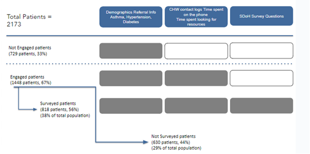
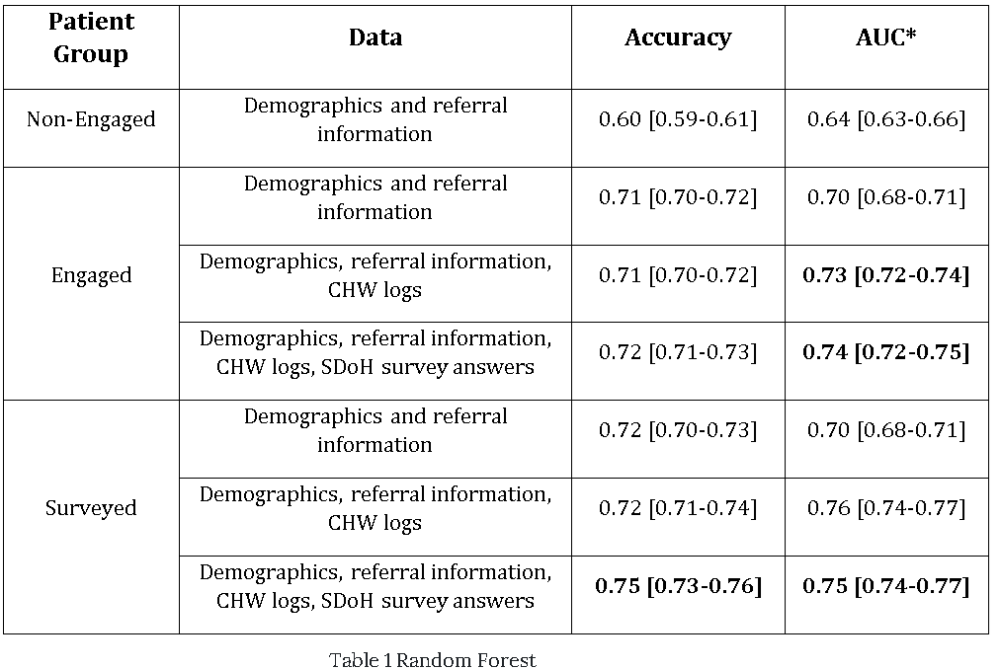

# Patient Emergency Department Readmission ML Predictor

## Overview

This study explores the role of Community Health Workers (CHWs) and Social Determinants of Health (SDoH) in reducing 30-day unplanned Emergency Department (ED) readmissions at Sinai Chicago. The research leverages machine learning to assess the impact of integrating CHWs and SDoH data in predictive models. By comparing patient readmission predictions with and without this data, the study demonstrates that when CHWs engage with patients, predictive accuracy improves by 13.0-15.2%.

## Motivation
Healthcare inequities remain a major challenge, particularly for minority and underserved communities. Studies indicate that SDoH contribute extensively to health disparities, yet their integration into predictive models remains limited. This project seeks to analyze how CHW interventions and SDoH data influence readmission risks, with the ultimate goal of optimizing resource allocation and improving healthcare delivery.

## Deep Dive Alert! 🚀

Want to understand the brains behind this project? 🤖💡 Check out my blog:

[Leveraging Community Health Workers for Predicting Emergency Department Readmission](https://ishi3012.github.io/the-code-diary/Sinai/sinai_intro.html)

## Features

- **Predictive Modeling**: Classification of high-risk patients for 30-day ED readmission using Electronic Medical Records (EMR) and SDoH data
- **Community Health Worker (CHW) Insights**: Incorporates CHW interventions as a key factor in readmission prediction.
- **Data Processing & Feature Engineering**: 
   - Aggregation of demographic, referral, and contact log data.
   - Feature extraction from SDoH screener responses.
   - Creation of new features such as comorbidity counts and engagement levels.
- **Machine Learning Approach**: 
   - Utilizes Random Forest Classification for readmission prediction.
   - Compares models with and without CHW intervention data.
   - Evaluates feature importance to identify key predictors of readmission.
   - Unsupervised learning algorithms to find patterns


## Data Source

The dataset for this study consists of 2,173 patient records, each with 315 features encompassing demographic information (e.g., age, sex), referral details (e.g., high-risk based on social worker assessments, discharge from the ED), Community Health Worker (CHW) contact logs (e.g., number of calls, length of calls), and Social Determinants of Health (SDoH) data (survey answers about food or housing insecurity). The data set is a collection of patients from Mt. Sinai and Holy Cross hospitals and were generally referred to the Sinai Urban Health Institute (SUHI) by social workers between July 2020 and February 2024.



## Methodology

### 1. Machine Learning 
- Random Forest Classifier
- KModes clustering
- Feature Importance Analysis
   

## Key Findings


### Summary of Clustering Analysis

- Cluster 0 (Largest Group – 47.54%)

      Comprised 1,033 patients with the lowest readmission rate.
      All patients were engaged with CHWs, and around 40% had completed SDoH surveys.
      The findings confirm that engagement reduces readmissions. Increasing survey participation within this group could further improve patient support and monitoring.

- Cluster 1 (Non-Engaged Patients – 33.59%)

      Consisted of 730 patients with the highest readmission rate.
      These patients had lower comorbidity levels and a higher representation of non-Hispanic individuals.
      The lack of engagement suggests a need for greater outreach efforts to encourage CHW participation and reduce readmissions.

- Cluster 2 (High-Engagement, Complex Cases – 18.87%)

      Included 410 patients with high levels of both CHW engagement and SDoH survey participation (96% engaged).
      Despite engagement, this group had relatively higher readmission rates, likely due to comorbidities and social challenges.
      This cluster had the highest percentage of Hispanic patients and the most complex health conditions.
      Findings suggest the need for tailored interventions targeting chronic conditions like hypertension and addressing unmet social needs to improve outcomes.

## Future Work
Qualitative Analysis of CHW Notes: Future research will involve analyzing CHW notes for qualitative insights, which could further enhance the predictive accuracy and provide richer context for patient needs.

## Installation & Usage
```bash
# Clone the repository
git clone https://github.com/ishi3012/predict_readmit_ml.git

# Install dependencies
pip install -r requirements.txt

# Run the analysis
python main.py

```